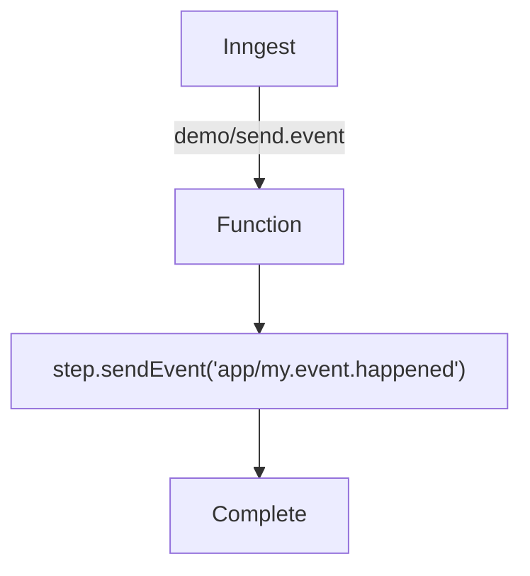

# Sending an Event Example

This examples demonstrates sending an event within a step function.

It is triggered by a `demo/send.event` event, and runs a single step to reliably send an event to Inngest.

