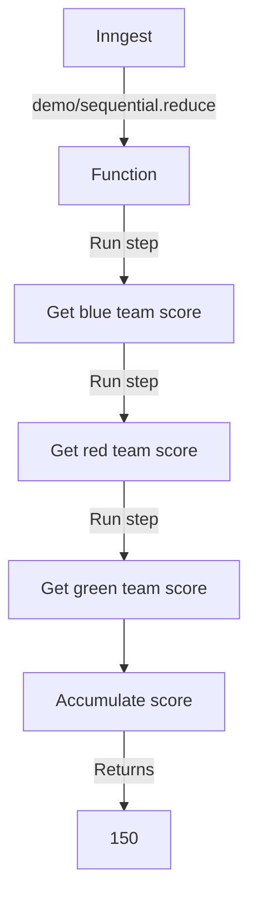

# Sequential Reduce Example

This example demonstrates how to run multiple steps in sequence to accumulate a value using `Array.prototype.reduce`.

It is triggered by a `demo/sequential.reduce` event, runs three steps sequentially to fetch scores from a database, and accumulates the total of all of the scores.

To see a parallel version of this pattern, see the [parallel reduce example](/src/examples/parallel-reduce).

