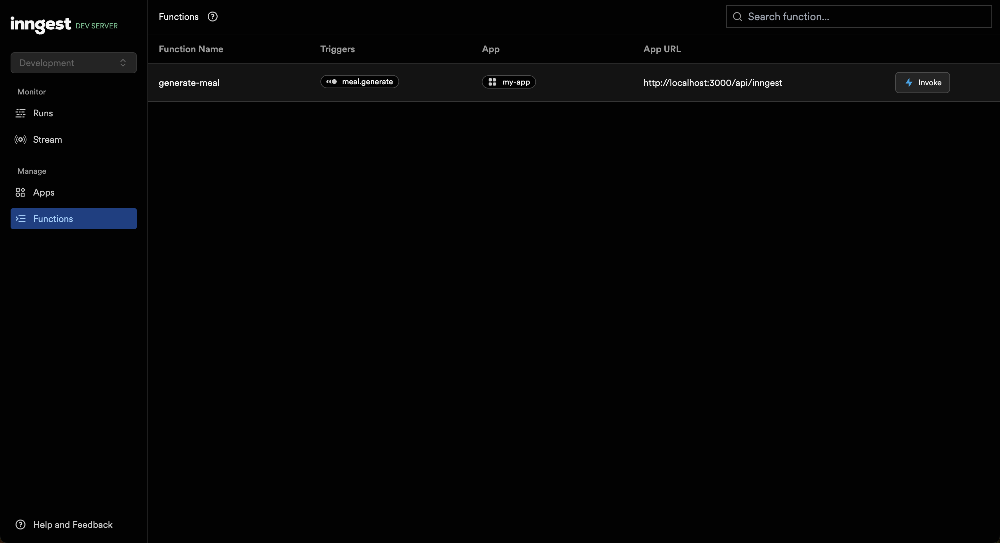
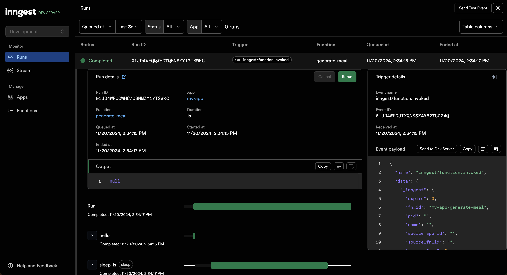
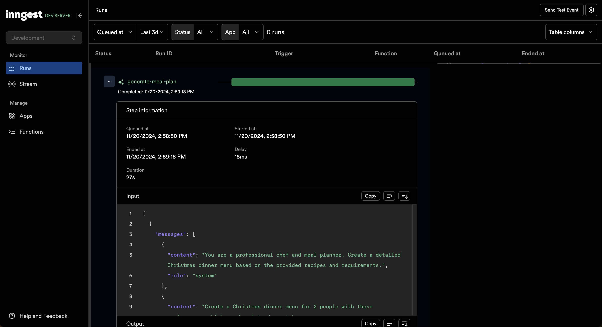
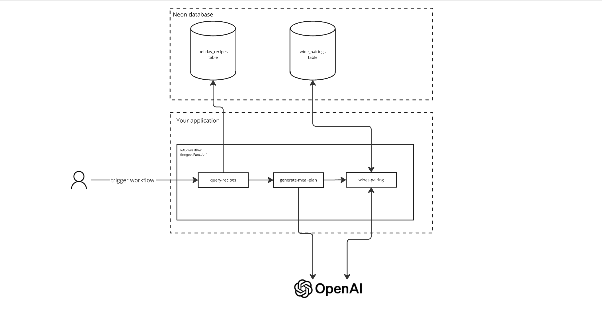

# Inngest Weekend challenge: Christmas Dinner AI Workflow

Feeling adventurous this weekend? ⚡️

Let's build a Christmas dinner generator workflow using Inngest and Neon using the following Hugging Face datasets:

- [`Thefoodprocessor/holiday`](https://huggingface.co/datasets/Thefoodprocessor/holiday) is a dataset of 74k meals paired with specific holidays (ex: “Christmas”)
- [`Thefoodprocessor/wine_type`](https://huggingface.co/datasets/Thefoodprocessor/wine_type) is a dataset 74k meal <> wine pairing (we’re in France! 🇫🇷)

> [!NOTE]
> The above datasets have been chunked and translated to json files, available in the Getting started section.

You will find below instructions to get Neon and Inngest up and running with the provided datasets to complete the challenge.

Happy hacking! 🤖 🎄

## **Prerequisites**

To complete this challenge, you will need:

- Node.js and npm installed
- A valid OpenAI API key (for embeddings and prompts)
- A Neon account ([you can create one for free](https://console.neon.tech/) in under 2 minutes)

## Getting started

First, checkout this repository:

```bash
git clone git@github.com:inngest/inngest-js.git
```

And run the following command:

```bash
cd examples/nextjs-christmas-dinner-generator-challenge
npm install
```

You will notice the following:

- a `data/` folder containing the datasets as JSON files
- a `scripts/` folder containing an `index.ts`

Let’s start by indexing our datasets into a Neon vector database.

### 1. **Setup our Neon vector database**

Go to the [Neon console](https://console.neon.tech/) and open the SQL Editor to copy the following:

```sql
CREATE EXTENSION IF NOT EXISTS vector;

CREATE TABLE IF NOT EXISTS "holiday_recipes" (
    "id" serial PRIMARY KEY NOT NULL,
    "content" text NOT NULL,
    "metadata" jsonb NOT NULL,
    "embedding" vector(512),
    "created_at" timestamp with time zone DEFAULT now(),
    "updated_at" timestamp with time zone DEFAULT now()
);

CREATE TABLE IF NOT EXISTS "wine_pairings" (
    "id" serial PRIMARY KEY NOT NULL,
    "content" text NOT NULL,
    "metadata" jsonb NOT NULL,
    "embedding" vector(512),
    "created_at" timestamp with time zone DEFAULT now(),
    "updated_at" timestamp with time zone DEFAULT now()
);

CREATE INDEX IF NOT EXISTS "embedding_idx"
ON "holiday_recipes"
USING hnsw ("embedding" vector_cosine_ops);

CREATE INDEX IF NOT EXISTS "embedding_idx"
ON "wine_pairings"
USING hnsw ("embedding" vector_cosine_ops);
```

### 2. **Index our datasets into our Neon vector database**

First, copy the `.env.example` file to `.env.local`.

Then, from your [Neon console](https://console.neon.tech/) project dashboard, grab your _DATABASE_URL_ and add it to your local `.env.local` file.

Finally, do the same for your OpenAI API Key.

You can now open the `scripts/index.ts` file.

The interesting bit is the `processJsonFile()` function that takes each dataset’s JSON file and indexes it in the Neon vector database.

You can now run the datasets indexing command by running:

```bash
npm run index-vector-store
```

This script takes up to 5 minutes to index the 20k records.

In the meantime, let’s set up an Inngest workflow for our application.

### **2. Setup Inngest and create a simple workflow**

Our project comes with Inngest already installed and ready to be used in Next.js.

Let’s walk through the main files:

**`src/inngest/events.ts`**

This file defines the events used to trigger our workflow.

The project comes with the event later used in our example to trigger the Christmas dinner generation workflow.

Events are composed of:

- a mandatory `name`
- an optional object as `data`

The events are created with [`zod`](https://zod.dev/) and passed to the Inngest client, enabling an E2E-typed experience.

**`src/inngest/functions.ts`**

This is where our workflow is defined, using `inngest.createFunction()`.

[Inngest Functions](https://www.inngest.com/docs/features/inngest-functions?ref=ai-hack-night-paris-2024) are composed of multiple steps, enabling you to write workflows relying on independently retriable steps.

Our first workflow is a simple example of multiple “hello worlds”.

**`src/server.ts`**

Inngest Functions are exposed to the Inngest Dev Server via a simple express server.

Let’s give a try at our sample Inngest workflow by starting the following commands (in separate terminal windows or tabs):

_Start the Next.js app:_

```bash
npm run dev
```

_Start the local Inngest Dev Server:_

```bash
npm run inngest
```

You can now open the Inngest Dev Server at [http://127.0.0.1:8288](http://127.0.0.1:8288/) and trigger the workflow from the “Functions” tab by clicking on the “Invoke” button using the following event:

```json
{
  "data": {
    "participantsCount": 2,
    "preferences": ["chicken", "chocolate dessert"]
  }
}
```



By switching to the “Runs” tab, you will see the workflow run in real-time, with all the information on each step input/output and status:



> [!NOTE]
> The Inngest DevServer is useful to trigger and rerun your workflow, and inspecting steps.
> ⚠️ All `console.log()` performed in an Inngest Workflow are printed in the Express server terminal.

Our datasets indexing should be complete; let’s update our Inngest Workflow by adding a sample Neon vector query and OpenAI call step!

### **3. Add a first Neon vector query and OpenAI call in our Inngest workflow**

Let’s now use our Neon vector database with some OpenAI calls into our Inngest workflow.

We use Neon's `similaritySearchWithScore()` query method to perform a vector similarity search based on a query to find some Christmas recipes that match our preferences.

Then, we use the search results to perform an OpenAI call to generate a meal plan.

Replace the `src/inngest/functions.ts` with the following:

```tsx
import { openai } from "inngest";
import { inngest } from "./client";
import { loadVectorStore } from "../lib/vectorStore";


export const generateMeal = inngest.createFunction(
  { id: "generate-meal", triggers: [{ event: "meal.generate" }] },
  async ({ event, step }) => {
    const { participantsCount, preferences } = event.data;

    const holidayRecipesVectorStore = await loadVectorStore("holiday_recipes");
    const winesPairingsVectorStore = await loadVectorStore("wine_pairings");

    // Query relevant holiday recipes based on preferences using vector similarity
    const relevantRecipes = await step.run("query-recipes", async () => {
      const query = `Christmas dinner recipes ${preferences.join(", ")}`;
      const results = await holidayRecipesVectorStore.similaritySearchWithScore(
        query,
        10
      );

      return results.map(([doc, score]) => ({
        recipe: doc.pageContent,
        title: doc.metadata.title,
        similarity: score,
      }));
    });

    // Generate meal plan using step.ai.infer()
    const mealPlan = await step.ai.infer("Generate a Christmas dinner menu", {
      model: openai({ model: "gpt-4" }),
      body: {
        messages: [
          {
            role: "system",
            content:
              "You are a professional chef and meal planner. Create a detailed Christmas dinner menu based on the provided recipes and requirements.",
          },
          {
            role: "user",
            content: `Create a Christmas dinner menu for ${participantsCount} people with these preferences: ${preferences.join(
              ", "
            )}.

      Use these recipes as inspiration:
      ${relevantRecipes.map((r) => r.recipe).join("\n\n")}

      Include:
      1. Appetizers
      2. Main course
      3. Side dishes
      4. Dessert
      5. Estimated preparation time
      6. Special instructions

      Format the response in a clear, organized way.`,
          },
        ],
        temperature: 0.7,
      },
    });

    // other steps...

    return {
      mealPlan
    }
);

export const functions = [generateMeal];
```

> [!NOTE]
> Take some time to familiarize yourself with the APIs and concepts used in the above example:
>
> - Neon's `holidayRecipesVectorStore.similaritySearchWithScore()` helps in finding matching meals
> - Inngest’s `step.ai.wrap()` helps getting better observability over your LLM calls, without having to `console.log()` them.

Navigate back to the Inngest Dev Server at [http://127.0.0.1:8288](http://127.0.0.1:8288/) and rerun the last workflow run from the “Runs” tab.

The Inngest Dev Server now highlights the steps relying on AI by showcasing some important information such as LLM inputs and outputs:



### You’re all set!

Your local project is now well set up and ready for action! You should also know enough to complete the next example.

Feel free to pursue your own project if you feel inspired or adventurous! 🤘

## Challenge

Now that you played with Neon vector queries and the Inngest workflow steps, let’s try to build the following complete Christmas dinner generator.

By taking a `"meal.generate"` Inngest event containing the number of participants and some preferences (ex: `[“chicken", "chocolate dessert"]`); our workflow will generate a Christmas dinner menu matching the provided preferences, add some wines pairing (_”french touch”_) and generate the associated shopping list:



### Complete our Christmas meal workflow

Take inspiration from the two first steps implemented in the “Getting started” section to add the following:

1. **Wine Pairing Enhancement**
   - Secondary RAG process for wine recommendations
   - Uses menu context to find relevant wines
   - Generates personalized pairing explanations
2. **Shopping list generation**
   - Uses menu context and suggests wines to generate a shopping list

**Useful documentation links**

- [Working with Inngest Workflow and steps](https://www.inngest.com/docs/features/inngest-functions/steps-workflows?ref=ai-hack-night-paris-2024)
- [Neon `pgvector` extension](https://neon.tech/docs/extensions/pgvector)

### Some additional ideas

Use the following suggestions to improve your project for the demo part!

**Combine additional datasets from [Thefoodprocessor](https://huggingface.co/Thefoodprocessor) to improve the generation relevancy**

The [https://huggingface.co/Thefoodprocessor](https://huggingface.co/Thefoodprocessor) project lists multiple other datasets, such as allergy and ingredient alternatives. You can download an additional `.parcel` file into the `data/` folder and run the `npm run generate-jsons` script to generate new JSON files.

Then, you can run the `npm run index-vector-store` script again and integrate the new Neon vector database into your Inngest workflow! 🚀

**Add more parameters to the `"meal.generate"` Inngest event and leverage Inngest step parallelism**

Adding more input parameters to the workflow could also improve the relevancy of our Christmas meal generator.

For example:

- each participant could be an object with advanced criteria (food, wine, etc)
- then, the Inngest workflow would generate a menu per person ([leveraging step parallelism](https://www.inngest.com/docs/guides/step-parallelism?ref=ai-hack-night-paris-2024)) and merge the final results into a unique menu
