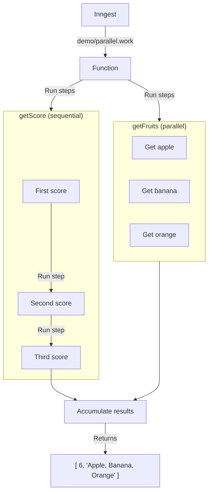

# Parallel Work Example

This example demonstrates how to run concurrent chains of work in the same step function, bringing their values together at the end.

It is triggered by a `demo/parallel.work` event, runs 2 separate chains of work in parallel: `getScore()` and `getFruits()`.

`getScore()` will run 3 steps sequentially, returning a `number` score.

`getFruits()` will run 3 steps in parallel, returning an array of fruits.

Finally, we return the result of these two chains of work at the end of the function.

