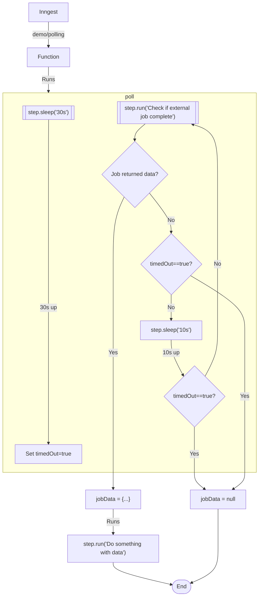

# Parallel Work Example

This example demonstrates how to run concurrent chains of work in the same step function to create a step that polls on a schedule, either returning a result or timing out.

It is triggered by a `demo/polling` event, and runs 2 separate chains of work in parallel: one for the timeout, and one for the poll. We declare this logic as a `poll()` function within the body of the step function.

