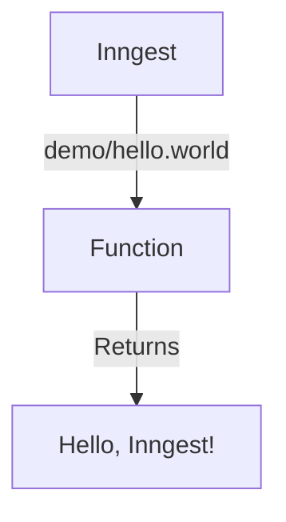

# Hello World Example

This demonstrates the simplest possible function. It's triggered by a `demo/hello.world` event and returns `"Hello, Inngest!"`.

```mermaid
graph TD
Inngest -->|demo/hello.world| Function
Function -->|Returns| Hello[Hello, Inngest!]
```
