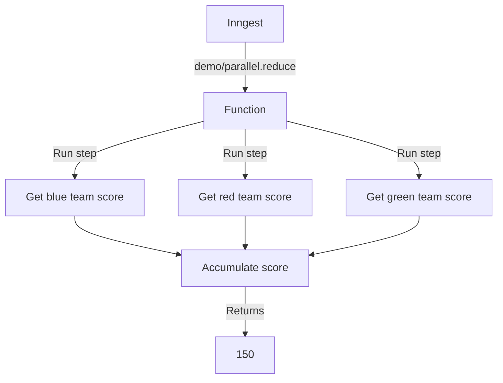

# Parallel Reduce Example

This example demonstrates how to run multiple steps in parallel to accumulate a value using `Array.prototype.reduce`.

It is triggered by a `demo/parallel.reduce` event, runs three steps in parallel to fetch scores from a database, and accumulates the total of all of the scores.

