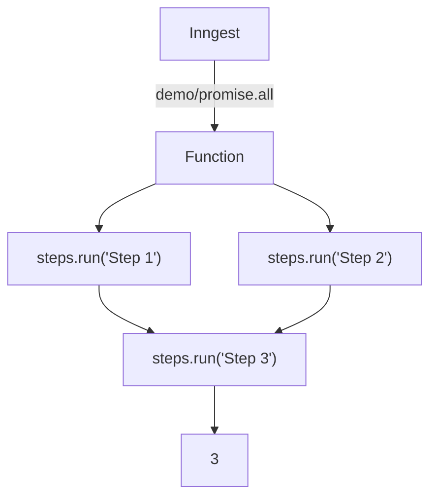

# Promise.all Example

This example demonstrates using `Promise.all()` to wait for concurrent chains of work to resolve before continuing; all step tooling returns a promise, so any pattern using async JavaScript is supported.

It is triggered by a `demo/promise.all` event, and runs 2 separate steps in parallel. Once both are complete, Step 3 runs and adds the result of both.

