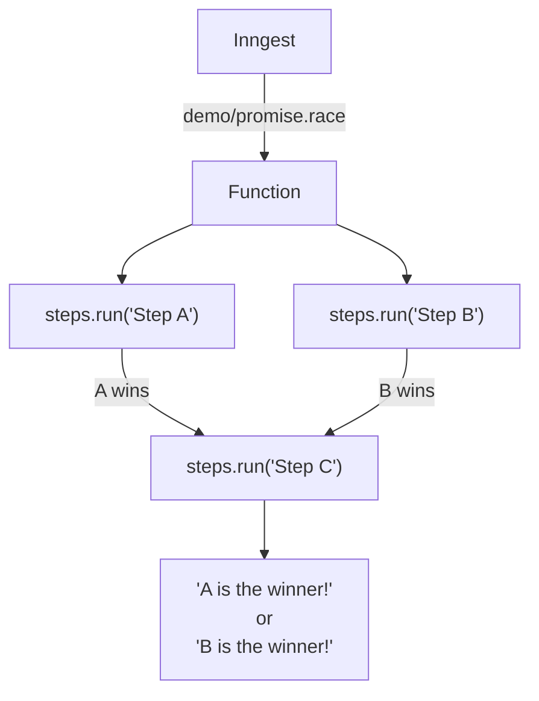

# Promise.race Example

This example demonstrates using `Promise.race()` to race concurrent chains of work against each other before continuing; all step tooling returns a promise, so any pattern using async JavaScript is supported.

It is triggered by a `demo/promise.race` event, and runs 2 separate steps in parallel. The first one to complete wins, and the final step logs the winner.

